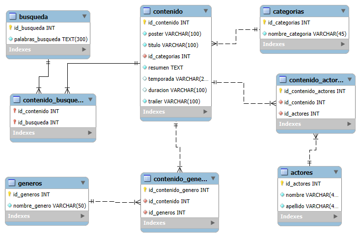

# Proyecto Integrador: CRUD con Node.js y MySQL

## Descripción del Proyecto

Este proyecto, desarrolla una plataforma de streaming usando Node.js y MySQL. Ádemas,utilizé Sequelize, este ORM nos permitirá manipular la bases de manera sencilla. La aplicación permitirá realizar operaciones CRUD (Crear, Leer, Actualizar, Eliminar) sobre una base de datos relacional. Se implementó Express Router para optimizar la arquitectura de las diferentes rutas.

## DER del Proyecto

Dentro de la carperta json se encuentra los datos de los contenidos del streaming, con ellos, desarrolle el siguiente modelo relacional. Donde cree 8 tablas:
- categorias:
Dentro estan las categorias.
- actores:
Dentro estan nombre y apellido de los actores.
- generos:
Dentro estan los generos.
- busqueda:
Dentro estan las palabras de busqueda.
- contenido:
Dentro estan  poster, titulo,id_categorias(FK-de categorias),resumen,id_busqueda(FK-de busqueda), temporada,duracion,trailer.
- contenido-generos:
Dentro se encuentra se cea la relacion entre contenido y los generos.
- contenido-actores:
Dentro se encuentra se cea la relacion entre contenido y los actores.
contenido_busqueda:
Dentro se encuentra se cea la relacion entre contenido y las palabras de busqueda.
- **En base a este esquema, se genero los script para crear una base de datos llamada "trailersFlix" e insertar las tablas dentro de MySQL Workbench .
Con ayuda AI, ingrese los datos en las tablas.**




## Estructura del Repositorio

```plaintext
/conexion/
  - database.js
/controllers
  - contenidoController.js
/json
  - trailerflix.json
/models/
  - contenido.js
  - categoria.js
  - genero.js
  - actor.js
/routes/
  - contenidoRoutes.js
/src
.env
.gitignore  
api.http
/app.js
/README.md
```

### Descripción de Archivos y carpetas

- **/conexion**: Carpeta que contiene archivos de conexión.
- **/controllers**: Carpeta que contiene los controladores de la aplicación.
- **/json**: Carpeta que contiene un archivos JSON con los datos de BD.
- **/models**: Carpeta que contiene los modelos de la aplicación.
- **/routes**: Carpeta que contiene las rutas de la aplicación.
- **/src**:Carpeta que contine dos carpetas con script para crear la BD y insert para cargar datos a la BD.
- **.env**: Archivo que contiene las variables de entorno.
- **.gitignore**: Archivo que indica qué archivos o carpetas no se deben incluir
- **api.http**: Archivo que contiene las rutas de la API, para verificar funcionalidad.
- **app.js**: Archivo principal de la aplicación donde se define toda la lógica de rutas. 
- **README.md**: Archivo con la descripción del proyecto.

## Funcionalidades del CRUD
En el archivo api.http se puede realizar las operaciones CRUD y verificar la funcionalidad de la aplicación, para las siguientes operciones, utlizando Rest client. Tambien puedes utilizar Postman.

- **GET /**: Obtener ruta principal.
- **GET /contenido**: Obtener todos los contenidos.
- **GET /contenido/:id**: Obtener contenido específico.
- **GET /contenido/:id/actores**: Obtener de un contenido específico los actores.
- **GET /contenido/name/:nameContenido**: Obtener contenido por su nombre.
- **GET /contenido/actor/:id_actor**: Obtener los contenido de un actor por su id.
- **GET /contenido/genero/:id_genero**: Obtener los contenido por su id genero.
- **GET /contenido/genero/nombre/:name**: Obtener los contenido por el nombre del genero.
- **POST /contenido**: Crear un nuevo contenido.
- **POST /contenido/actor**: Crear un actor para contenido.
- **POST /contenido/:id_contenido/actor/:id_actor**: Asociar contenido y actor.
- **PUT /contenido/:id**: Actualizar un contenido.
- **PATCH /contenido/:id**: Actualizar un contenido parcialmente.
- **POST /contenido/:id_contenido/genero/nombre/:nombre**: Asociar contenido y genero.
- **POST /contenido/busqueda**: Crea una nueva palabra de busqueda.
- **POST /contenido/:id/busqueda/:id**: Asociar contenido con palabra de busqueda.
- **DELETE /contenido/:id/actor/id**: Eliminar un actor de contenido. 
- **DELETE /contenido/:id**: Eliminar un contenido. 


## Instrucciones :


***Crear archivo principal de la aplicación :***
- app.js

***Inicializar el proyecto :***
- npm init -y

***Agregar las siguientes dependencias:***

- npm i express mysql2 sequelize

***Agregar en los script del archivo package.json:***
 
- "start": "node  -- watch app.js"

***Crear archivo de configuración de variables de entorno:***

- .env

***Crear archivo de conexión a la base de datos dentro de la carperta conexion:***

- conexion/database.js

***Crear archivo de controlador a la base de datos dentro de controllers:***

- controllers/contenidoController.js

***Crear archivos de modelos a la base de datos dentro de models:***

- models/contenido.js

***Crear archivo de rutas dentro de routes:***

- routes/contenidoRouter.js

***Crear archivo para probar las rutas:***

- api.http

***Crear el servidor dentro de app.js***

La aplicación se inicializa y agregá la escucha de la conexión en el puerto 3008.

***Ejecutar el proyecto en terminal:***

- npm start
- Abrir en el navegador :
 http://localhost:3008/


## Datos Proporcionados:
Se proporciona dentro de la carpeta json un archivos correspondiente a los datos de los contenidos para cargar en la BD utilizando IA.
Sin embargo, se proporcionar dentro de la carpeta SRC dos carpetas: En uno, con los script para crear la BD y en el otro, con los insert para cargar 50 contenidos y realizar las pruebas del funcionamiento del CRUD.


## Environment Variables
Para correr este proyecto, deberás modificar el archivo .env_copy por .env.
Para la de conexión , 
- DATABASE= NOMBRE_BD
- DBUSER=YOUR_ROOT
- PASSWORD=YOUR_PASSWORD
- HOST= localhost
- PORT= 3008

## Autor
- https://github.com/sara-villagra


## Resumen:
Este proyecto desarrolla una plataforma de streaming utilizando Node.js, MySQL y Sequelize para implementar operaciones CRUD (Crear, Leer, Actualizar, Eliminar) sobre una base de datos relacional. Se usa Express Router para gestionar las rutas de la aplicación.
Estructura del Proyecto
Se crearon 8 tablas principales: categorias, actores, generos, busqueda, contenido, contenido-generos, contenido-actores, y contenido_busqueda para modelar la base de datos "trailersFlix".
La estructura del repositorio incluye carpetas como 
- /conexion, 
- /controllers, 
- /json, 
- /models, 
- /routes, 


entre otras, organizando archivos de conexión, controladores, modelos, rutas y datos en formato JSON.


El CRUD permite:


Obtener todos los contenidos, contenidos por ID, actores de un contenido, géneros, y búsquedas.
Crear nuevos contenidos, actores, géneros, y búsquedas, así como asociar actores o géneros a los contenidos.
Actualizar o eliminar contenidos.

Datos:


Se incluyen scripts para crear la base de datos y cargar datos de prueba.


